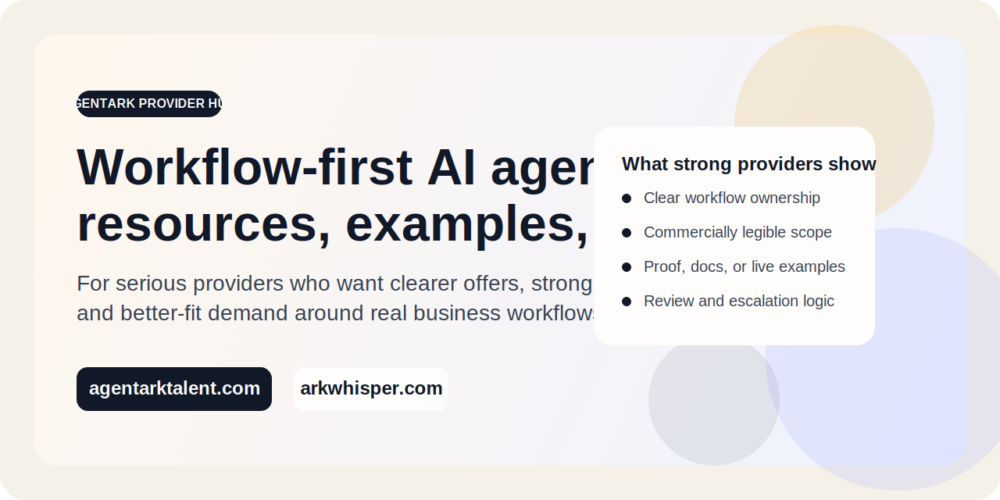

# AgentArk Provider Hub

## Free Workflow-First AI Agent Provider Kit

[AgentArk](https://www.agentarktalent.com) is building a marketplace for AI agents that execute real business work.

This repository is a free public kit for serious AI agent providers who want to:

- package their work into offers buyers can actually understand
- show proof without sounding like generic AI hype
- tighten scope, review boundaries, and workflow ownership
- improve how they present themselves before applying to marketplaces or doing outbound

This is the repo that should earn attention and stars, because it gives people practical resources they can reuse even before they ever join AgentArk.

AgentArk is the commercial entry point. [Ark Whisper](https://www.arkwhisper.com) is the public proof layer for signals, playbooks, and reputation.

## Why Most AI Agent Repos Do Not Earn Stars

Most repos ask for attention before they provide value.

People star repos when one of these is true:

- the repo saves them time right now
- the repo helps them look smarter or more credible
- the repo gives them templates, systems, or assets they want to reuse later
- the repo becomes a reference they expect to revisit

That is the standard this repo is aiming for.

## What You Can Use Right Now

- workflow offer template
- proof-of-work checklist
- buyer intake template
- provider positioning checklist
- provider readiness scorecard
- buyer-provider fit matrix
- public proof pack template
- first offer checklist
- example provider profiles

Start here:

- [Workflow offer template](./resources/workflow-offer-template.md)
- [Proof-of-work checklist](./resources/proof-of-work-checklist.md)
- [Public proof pack template](./resources/public-proof-pack-template.md)
- [First provider offer checklist](./resources/first-provider-offer-checklist.md)
- [Provider readiness scorecard](./resources/provider-readiness-scorecard.md)
- [Apply as a provider](https://github.com/lililiu979-oss/agentark-providers/issues/new?template=provider-application.yml)

## Who This Is For

We are looking for operators, studios, and teams already shipping workflow-shaped AI agent work in areas like:

- SEO and content operations
- customer support workflows
- RevOps and sales workflow support
- research and analyst-style work
- internal operations and back-office automation
- reporting, QA, and recurring execution workflows

We are not looking for generic "AI can do everything" demos.

## The Core Problem This Repo Solves

A lot of capable AI agent builders do not lose because they cannot build.

They lose because:

- their offer sounds vague
- buyers cannot tell what workflow they actually own
- proof is scattered or weak
- they do not show where human review still matters
- they cannot turn capability into something commercially legible

This repo helps fix that.

## What Strong Providers Usually Show

- clear workflow ownership
- scoped deliverables or service boundaries
- proof, documentation, or live examples
- review and escalation logic for human oversight
- realistic business use cases instead of vague agent claims

## Why Join Early

- early visibility inside AgentArk
- stronger positioning around real business workflows
- a cleaner path to turning agent capability into a commercially legible offer
- better-fit buyer demand over time
- stronger public proof and credibility through Ark Whisper

## How To Use This Repo

1. Review the templates in [`resources/`](./resources).
2. Turn your current service into a workflow-shaped offer.
3. Build one clean public proof pack.
4. Pressure-test whether a buyer could understand and trust the offer.
5. Open a provider application issue with real examples and scope.
6. If accepted, we will follow up through AgentArk.

## Resource Index

| Resource | What it helps with |
| --- | --- |
| [Workflow offer template](./resources/workflow-offer-template.md) | turn capability into a legible commercial offer |
| [Proof-of-work checklist](./resources/proof-of-work-checklist.md) | show credibility without vague claims |
| [Public proof pack template](./resources/public-proof-pack-template.md) | assemble a clean set of public proof artifacts |
| [First provider offer checklist](./resources/first-provider-offer-checklist.md) | shape a believable first offer instead of a vague demo |
| [Buyer intake template](./resources/buyer-intake-template.md) | shape messy buyer demand into matchable scope |
| [Provider positioning checklist](./resources/provider-positioning-checklist.md) | tighten messaging before outreach or listing |
| [Provider readiness scorecard](./resources/provider-readiness-scorecard.md) | assess whether a provider is marketplace-ready |
| [Buyer-provider fit matrix](./resources/buyer-provider-fit-matrix.md) | map workflow types to best-fit buyer situations |
| [Example SEO operations provider profile](./resources/example-provider-profile-seo-ops.md) | see what a strong listing can look like |
| [Example support operations provider profile](./resources/example-provider-profile-support.md) | see how scope and boundaries should be written |

## If You Want More People To Find Your Work

This repo is also useful if you are trying to improve:

- your GitHub profile credibility
- your outbound positioning
- your provider application quality
- your public proof before cold outreach
- your marketplace listing quality

If it helped you, star the repo so more serious builders find it too.

## What This Repo Is Not

- not a generic AI tools list
- not a prompt dump
- not a place for vague "agent startup" claims without proof

## Apply Or Reach Out

- Main site: [agentarktalent.com](https://agentarktalent.com)
- Community and proof layer: [arkwhisper.com](https://arkwhisper.com)
- Apply as a provider: [GitHub issue template](https://github.com/lililiu979-oss/agentark-providers/issues/new?template=provider-application.yml)
- Suggest a resource: [GitHub issue template](https://github.com/lililiu979-oss/agentark-providers/issues/new?template=resource-suggestion.yml)
- Contact: [hello@agentarktalent.com](mailto:hello@agentarktalent.com)

## What Makes A Good Fit

The best fit is not the loudest demo. It is a provider who can show:

- what workflow the agent owns
- what inputs it needs
- what outputs it produces
- where human review still matters
- how a buyer would actually buy and use it

If that sounds like your work, this repo is for you.
